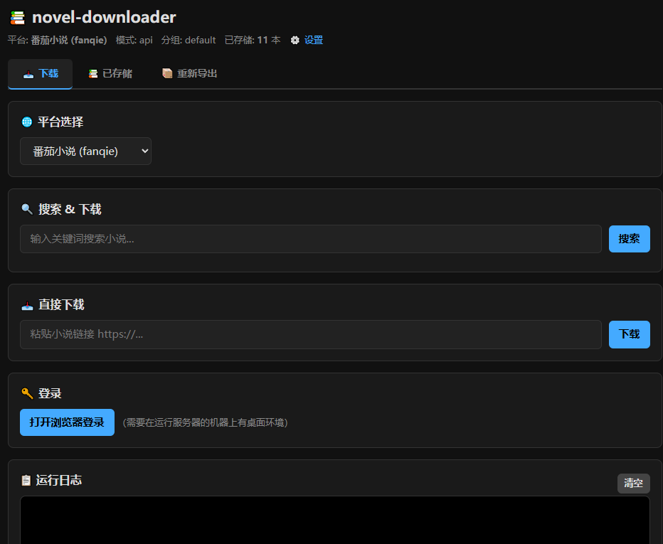

# novel-downloader

一个可拓展的小说下载工具  
> 目前只支持番茄平台的  
> 由之前的项目：[NovelDownloader](https://github.com/canyang2008/NovelDownloader) 重构而来。由于此项目结构过于混乱，所以秽土转生了。

## 特色
1. 三种下载模式： `API`,`Browser`, `Requests`
2. 配置灵活，针对不同网站做不同配置
3. 多线程，断点续传
4. 分组导出小说文件
5. 跨三大平台

## 功能

- **登录** — 打开浏览器手动登录，自动保存 Cookie
- **搜索** — 关键词搜索小说
- **下载** — 多线程并发下载章节正文和网页插图
- **更新** — 扫描已下载小说，自动检查并下载新章节
- **导出** — 支持 TXT、EPUB、IMG（图片）三种格式

## 下载模式

### API

API模式采用第三方API服务下载小说，它简单高效，但是需要`key`作为下载凭证。  
在使用此模式之前请检查配置文件是否填写`key`。  

#### 获取key方式

| 网站  | API名称  | 所属                           | 获取key方式               | 备注               |
|-----|--------|------------------------------|-----------------------|------------------|
| 番茄  | oiapi  | [OIAPI](https://oiapi.net/)  | 1. 加入官方QQ群，找到机器人卡特注册  | 下载次数有限，每天签到获取额度  |
| ...|

将获取到的 key 填写到配置文件`app_data/config/sites/{website}.yaml` 的 key 字段之中


### Browser

通过操作浏览器访问网站下载小说，它比较吃内存，如果要下载插图它是不二之选。  
网站一般有反爬虫机制，比如弹出验证码等。通过降低访问频率减少触发次数。  
目前支持的浏览器类型只有Chrome。**使用此模式时请检查电脑上有没有安装Chrome**  
**该模式需要您解锁相关章节，不可以获取未解锁的章节**
**通过`登录功能`登录相关账号。数据安全保存在`app_data/browser`中**

### Requests

最基本的下载模式，也是访问目标网站下载。  
此模式也是访问目标网站来下载的。也会被反制。没有代理不建议使用它。  
**该模式需要您解锁相关章节，不可以获取未解锁的章节**  
Cookie是账号的唯一凭证，也通过`登录功能`获取的。自动保存在相关配置文件中。

## 安装

Termux用户需要把 requirements.txt 的`DrissionPage`删除然后再pip

```bash
git clone https://github.com/volcyano42/novel-downloader.git
cd novel-downloader
pip install -r requirements.txt
```

## 快速开始

### 交互模式：

```bash
python main.py
```

启动后进入交互菜单：

```
当前分组: default  |  模式: browser
> 🔑 登录
  🔍 搜索 & 下载
  🔄 更新已下载
  📦 重新导出
  📥 直接下载 (输入 URL)
  退出
```

WEB UI模式：

```bash
python service.py
```
启动后进入界面  




#### 如何使用

下载之前先获取小说目录页链接，然后填写就可以下载了  
搜索书籍名称也可以直接下载

# 免责声明

本项目以兴趣和研究为目的，使用者请在遵守相关法律法规下下载。**不过度采集，越权采集或售卖，引发的风险和后果，违者需自行承担**  

如果您有任何疑问可以提交[issues](https://github.com/volcyano42/novel-downloader/issues)，作者虽然没有时间，但是一定会回的

# 作者
volcyano